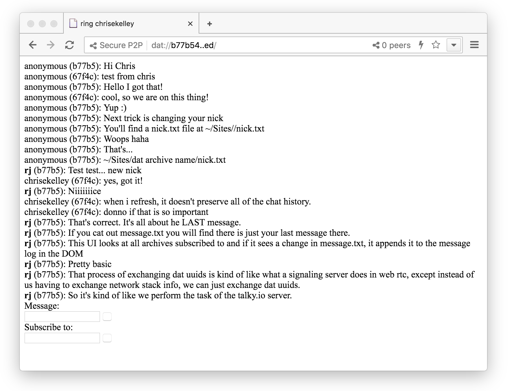

# Dat Outbox
A P2P chat app over Dat Protocol using Beaker Browser's DatArchive API. This app is a very rough proof of concept but it works! Inspired by a conversation with Paul Frazee and Don Blair (https://github.com/beakerbrowser/beaker/issues/603).

To connect outboxes..
1. Go to dat://ring.hashbase.io/
2. Both you and your buddy fork it. Name the fork something that will remind you who you are connecting with like "Ring Samantha".
3. Exchange new Dat URLs and subscribe to each other in the app.
4. To change your nickname, change the contents of the file at `~/Sites/your dat/nick.txt`.

